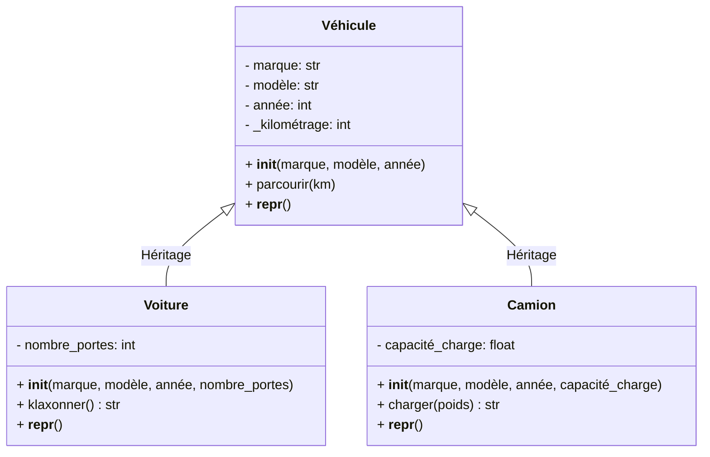
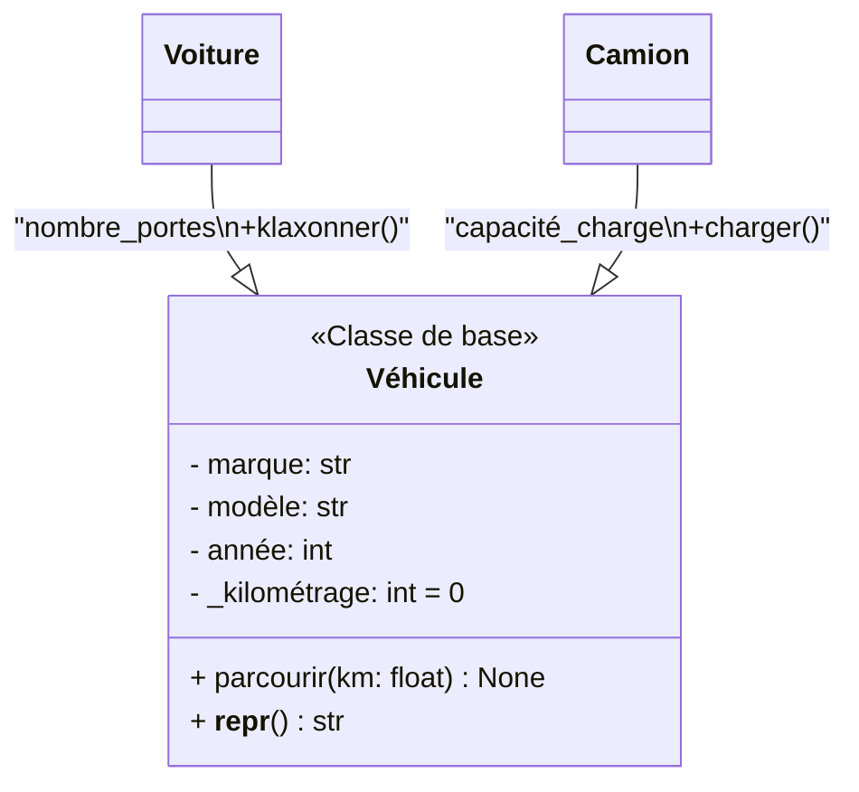

# Définitions des Concepts Clés en POO (Python)

Voici les définitions des termes techniques utilisés dans l'exemple d'héritage, avec une focalisation sur leur application en Python:

## 1. Héritage (Inheritance)
**Définition**: Mécanisme permettant de créer une nouvelle classe (classe enfant) à partir d'une classe existante (classe parent), en récupérant ses attributs et méthodes.


## 2. Surcharge (Method Overriding)
**Définition**: Redéfinition dans une classe enfant d'une méthode existante dans la classe parent pour modifier son comportement.

#### Exemple : Modélisation d'une hiérarchie de véhicules

Créez un système de classes pour représenter différents types de véhicules, en utilisant l'héritage. Nous allons:

1. Créer une classe de base `Véhicule`
2. Créer des classes dérivées `Voiture` et `Camion`
3. Utiliser `__repr__` pour avoir une bonne représentation des objets
4. Montrer comment les méthodes peuvent être héritées et surchargées

**Dans notre exemple**:  
- Chaque classe surcharge `__repr__` pour inclure ses attributs spécifiques
- `Voiture` ajoute `nombre_portes`, `Camion` ajoute `capacité_charge`

**Caractéristiques**:  
- Même nom de méthode que le parent
- Même signature (paramètres) en général
- On peut appeler la version parent avec `super()`

## 3. Extension
**Définition**: Ajout de nouvelles fonctionnalités (attributs ou méthodes) spécifiques à une classe enfant.

**Dans notre exemple**:  
- `Voiture` ajoute `klaxonner()` et `nombre_portes`
- `Camion` ajoute `charger()` et `capacité_charge`

**Différence avec la surcharge**:  
- Extension = ajout de nouvelles méthodes
- Surcharge = modification de méthodes existantes

## 4. Polymorphisme
**Définition**: Capacité d'un objet à prendre plusieurs formes, c'est-à-dire à répondre différemment à une même méthode selon son type.

**Dans notre exemple**:  
- Tous les véhicules ont `parcourir()` mais:
  - Un `Camion` pourrait avoir une implémentation différente (usure plus rapide)
- `__repr__` donne des résultats différents selon le type

**Types de polymorphisme**:  
- **Surcharge** (overriding): comme dans notre exemple
- **Surcharge d'opérateur**: redéfinir `+`, `-`, etc. avec `__add__`, `__sub__`
- **Duck typing**: utilisation d'objets différents de la même manière s'ils ont les mêmes méthodes

## Autres Termes Importants

### 5. Encapsulation
**Définition**: Principe de masquer les détails internes d'une classe et de n'exposer que ce qui est nécessaire.

**Dans notre exemple**:  
- `_kilométrage` avec un `_` indique que c'est un attribut "protégé" (convention Python)
- On modifie le kilométrage uniquement via `parcourir()`

### 6. super()
**Définition**: Fonction permettant d'accéder aux méthodes et attributs de la classe parente.

**Usage typique**:  
```python
super().__init__(args)  # Appel au constructeur parent
super().methode()      # Appel à une méthode du parent
```

### 7. Classe Parent/Enfant (Base/Derived)
- **Classe parent**: classe de base dont on hérite (`Véhicule`)
- **Classe enfant**: classe qui hérite (`Voiture`, `Camion`)

### 8. Méthodes Magiques
**Définition**: Méthodes spéciales avec `__nom__` qui permettent de définir des comportements spécifiques.

**Exemples**:  
- `__repr__`: représentation de l'objet
- `__init__`: constructeur
- `__str__`: version lisible pour les humains

Ces concepts sont fondamentaux en Programmation Orientée Objet et Python les implémente de manière très flexible par rapport à d'autres langages.
## Retour à L'exemple



### Explications du diagramme :

1. **Notation UML** :
   - `-` = attribut privé (convention Python avec `_`)
   - `+` = méthode publique
   - `:` indique le type (optionnel en Python)

2. **Relations** :
   - Flèche creuse `<|--` = héritage
   - La classe parente (`Véhicule`) est en haut

3. **Spécificités Python** :
   - Les méthodes magiques (`__repr__`) sont incluses
   - Les attributs "protégés" (avec `_`) sont notés comme privés

4. **Variante avancée** :


Ce diagramme montre clairement :
- L'héritage hiérarchique
- Les attributs/méthodes hérités
- Les extensions spécifiques à chaque classe enfant
- La surcharge de `__repr__` dans chaque classe

Vous pouvez copier ce code dans n'importe quel outil supportant Mermaid (comme GitHub, VS Code avec extension Mermaid, etc.) pour visualiser le diagramme interactivement.

## Implémentation 
### Exercice pour illustrer l'héritage en Python 

retournons à exemple qui montre l'héritage en Python, en mettant l'accent sur la méthode `__repr__` pour une bonne représentation des objets:


```python
class Véhicule:
    def __init__(self, marque, modèle, année):
        self.marque = marque
        self.modèle = modèle
        self.année = année
        self._kilométrage = 0
    
    def parcourir(self, km):
        if km > 0:
            self._kilométrage += km
        else:
            raise ValueError("Le kilométrage doit être positif")
    
    def __repr__(self):
        return f"{self.__class__.__name__}(marque='{self.marque}', modèle='{self.modèle}', année={self.année}, kilométrage={self._kilométrage})"


class Voiture(Véhicule):
    def __init__(self, marque, modèle, année, nombre_portes):
        super().__init__(marque, modèle, année)
        self.nombre_portes = nombre_portes
    
    def klaxonner(self):
        return "Tut tut!"
    
    def __repr__(self):
        return f"{super().__repr__()[:-1]}, nombre_portes={self.nombre_portes})"


class Camion(Véhicule):
    def __init__(self, marque, modèle, année, capacité_charge):
        super().__init__(marque, modèle, année)
        self.capacité_charge = capacité_charge  # en tonnes
    
    def charger(self, poids):
        if poids <= self.capacité_charge:
            return f"Chargement de {poids} tonnes effectué"
        else:
            return f"Capacité dépassée! Maximum: {self.capacité_charge} tonnes"
    
    def __repr__(self):
        return f"{super().__repr__()[:-1]}, capacité_charge={self.capacité_charge})"


# Utilisation
if __name__ == "__main__":
    # Création d'instances
    v1 = Véhicule("Generic", "Basic", 2020)
    voiture1 = Voiture("Toyota", "Corolla", 2021, 4)
    camion1 = Camion("Volvo", "FH16", 2019, 40)
    
    # Utilisation des méthodes
    v1.parcourir(15000)
    voiture1.parcourir(5000)
    camion1.parcourir(80000)
    
    # Affichage avec __repr__
    print(v1)  # Véhicule(marque='Generic', modèle='Basic', année=2020, kilométrage=15000)
    print(voiture1)  # Voiture(marque='Toyota', modèle='Corolla', année=2021, kilométrage=5000, nombre_portes=4)
    print(camion1)  # Camion(marque='Volvo', modèle='FH16', année=2019, kilométrage=80000, capacité_charge=40)
    
    # Méthodes spécifiques
    print(voiture1.klaxonner())  # Tut tut!
    print(camion1.charger(35))  # Chargement de 35 tonnes effectué
    print(camion1.charger(45))  # Capacité dépassée! Maximum: 40 tonnes
```

## Ce que cet exemple illustre:

1. **Héritage**: `Voiture` et `Camion` héritent de `Véhicule`
2. **Surcharge de méthode**: Chaque classe a sa propre implémentation de `__repr__`
3. **Réutilisation de code**: `super().__repr__()` est utilisé pour éviter la duplication
4. **Extension**: Les classes enfants ajoutent des attributs et méthodes spécifiques
5. **Polymorphisme**: Tous les véhicules ont `parcourir()` mais peuvent avoir d'autres méthodes spécifiques

Cet exemple montre clairement comment l'héritage permet de créer une hiérarchie logique tout en gardant un code propre et maintenable. La méthode `__repr__` est particulièrement bien utilisée pour montrer comment les classes enfants peuvent étendre le comportement de la classe parent.

**Dans notre exemple**:  
- `Voiture` et `Camion` héritent de `Véhicule`
- Elles obtiennent automatiquement `__init__`, `parcourir` et `__repr__` de base

**Syntaxe Python**:  
```python
class Enfant(Parent):
```