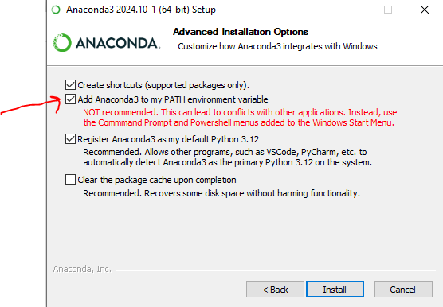

# Email : abdallah.khemais@gmail.com

# Télécharger le répo 
https://github.com/nevermind78/Python4LM25
# Installer anaconda 
> Télécharger depuis ce [lien](https://www.anaconda.com/download/success)

> cocher " ajouter anaconda au path "

# Installer Vs code

> télécharger Vs code depuis ce [lien](https://code.visualstudio.com/download)

